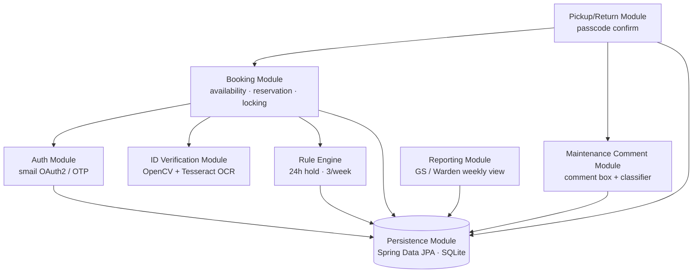

# Architecture

Single Spring Boot application, split into eight modules. Each module exposes a narrow Java service interface that other modules call. **No module reads another module's tables directly** — everything goes through the interfaces below, so a module's internals can change without breaking callers.

Source: the CS5013 design doc (`docs/proposal/design-doc.tex`, 11 Sep 2026).

## Module dependency graph



Arrows mean "calls the interface of". The resident-facing web layer (Thymeleaf controllers) sits above Auth, Booking, Txn, and Maint; the GS-facing layer sits above Report.

## Modules and interfaces

### 1. Auth Module — `auth`
Institute smail login via Spring Security + OAuth2 (OTP fallback per risk 2).

```java
ResidentSession   login(String oauthToken);
ResidentIdentity  currentResident(ResidentSession s);   // {rollNumber, smailAddress}
```

### 2. ID Verification Module — `idverify`
OpenCV preprocessing (locate card, deskew, de-glare) + Tesseract OCR on the resident's ID card photo. Runs **at booking time on the resident's own phone**, not at the stand — so a bad photo can be retaken without a guard waiting.

```java
ExtractedIdentity scanCard(byte[] imageBytes);          // {name, rollNumber, hostel, confidence}
boolean           matchesLogin(ExtractedIdentity e, ResidentIdentity r);
```

Only the extracted text is persisted. The photo is never stored.

### 3. Rule Engine — `rules`
The hostel's own booking rules, kept separate from the booking flow so they can be unit-tested in isolation and overridden by the GS (risk 4).

```java
EligibilityResult checkEligibility(long residentId);    // {allowed, reason}
```

Rules: at most **24 hours** held per rental; at most **3 rentals per rolling 7 days**.

### 4. Booking Module — `booking`
Availability, reservation, and concurrency control over the cycle pool. `createBooking` calls `IdVerificationService.matchesLogin` and `RuleEngine.checkEligibility` before committing, and takes a DB-level lock on the cycle row so two residents can't book the same cycle.

```java
List<CycleStatus> getAvailability();
Booking           createBooking(long residentId, long cycleId, ExtractedIdentity id);
```

### 5. Pickup/Return Module — `transaction`
The guard-witnessed step at the cycle stand. The resident enters their passcode in the app; the guard watches and hands over / accepts the cycle. **The guard has no device.**

```java
CycleState confirmPickup(long bookingId, String passcode);
CycleState confirmReturn(long bookingId, String passcode, String guardConditionNote);
```

### 6. Maintenance Comment Module — `maintenance`
Post-return free-text comment box. Comments go through a small OpenNLP classifier trained on our labeled phrase set. The raw comment is always shown alongside the flags (ADR 0003).

```java
List<MaintenanceFlag> submitComment(long bookingId, String text);
List<String>          classify(String text);          // CommentClassifier
```

### 7. Reporting Module — `reporting`
GS/Warden-facing weekly view.

```java
UsageReport           getWeeklyUsageReport();
List<MaintenanceFlag> getMaintenanceList();
```

### 8. Persistence Module — `persistence`
Spring Data JPA over SQLite. Repositories: `ResidentRepository`, `CycleRepository`, `BookingRepository`, `CommentRepository`, `MaintenanceFlagRepository`. Used by every module; bypassed by none.

## Cycle state machine

```
AVAILABLE ──createBooking──▶ BOOKED ──confirmPickup──▶ ISSUED ──confirmReturn──▶ AVAILABLE
                                                                    │
                                                  (flag from comment/guard note)
                                                                    ▼
                                                              UNDER_REPAIR ──GS clears──▶ AVAILABLE
```

A booking that isn't picked up within its window returns the cycle to `AVAILABLE`; a cycle held past 24 h is flagged `OVERDUE` on the booking (cycle stays `ISSUED`).

## Data model (entities)

| Entity | Key fields |
|---|---|
| `Resident` | id, rollNumber, name, hostel, smailAddress, passcodeHash |
| `Cycle` | id, label, state (`CycleState`), lastReturnedAt |
| `Booking` | id, resident, cycle, createdAt, pickedUpAt, returnedAt, overdue |
| `Comment` | id, booking, text, createdAt |
| `MaintenanceFlag` | id, cycle, comment (nullable), label, source (`COMMENT` / `GUARD`), resolvedAt |

## Test plan (one per module)

| Module | Test |
|---|---|
| Auth | unauthenticated request to a protected route → 401; valid token → correct `ResidentIdentity` |
| ID Verification | known-good photo → expected roll number, confidence ≥ threshold; blurred photo → low confidence, not a confident wrong match |
| Rule Engine | 3 bookings this week → 4th denied; 23 h held → fine, 25 h → overdue |
| Booking | two threads book the same cycle → exactly one succeeds, other gets "already booked" |
| Pickup/Return | wrong passcode → state unchanged; correct → `BOOKED→ISSUED`, later `ISSUED→RETURNED` |
| Maintenance | "chain keeps slipping off" → chain flag; "cycle is totally fine" → no flags |
| Reporting | seeded bookings → exact expected usage hours per cycle |
| Persistence | save `Booking`, fetch by id → all fields round-trip |
